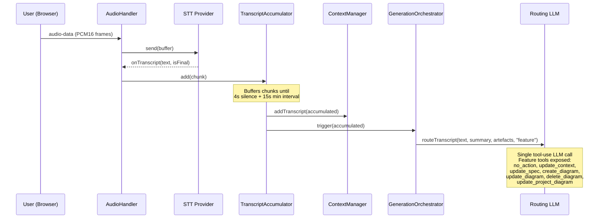
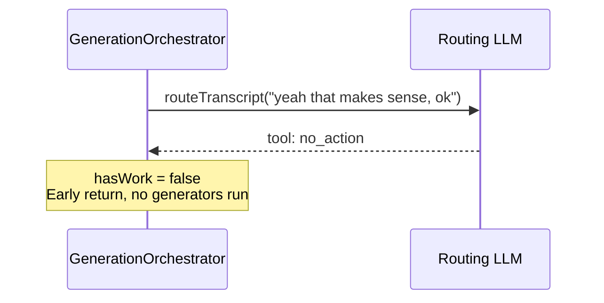
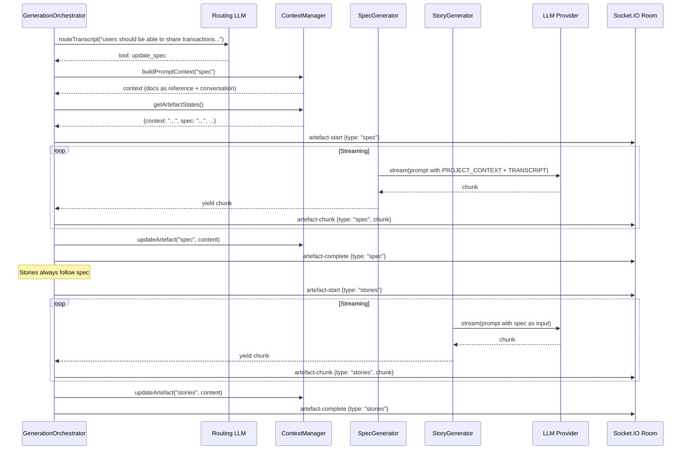
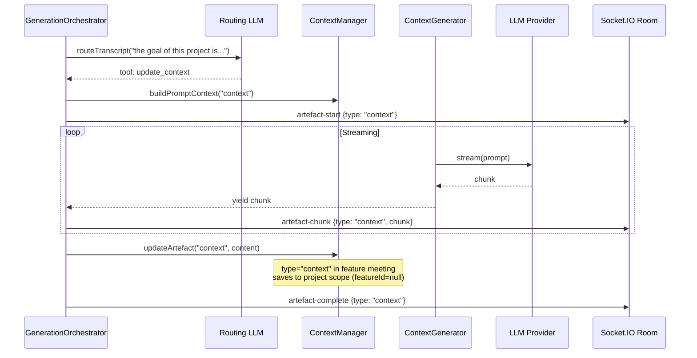
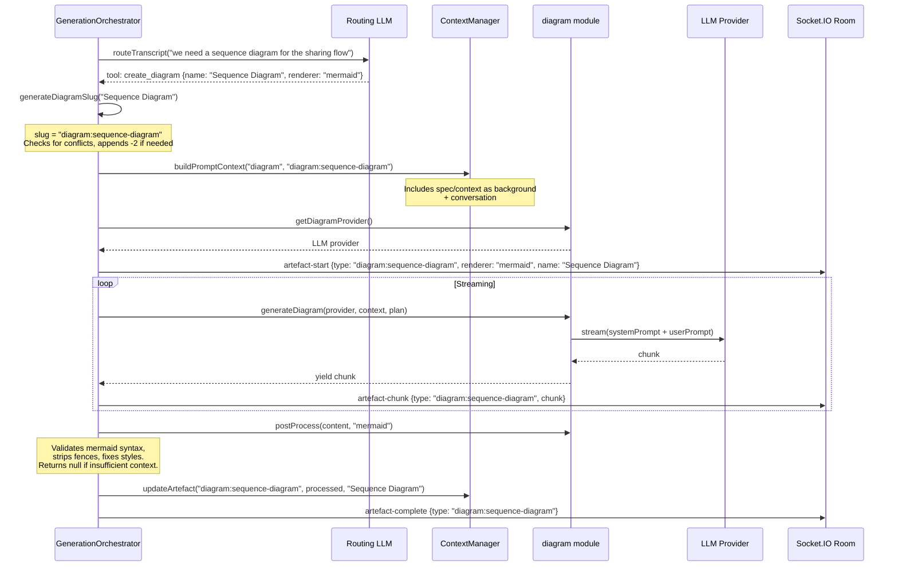
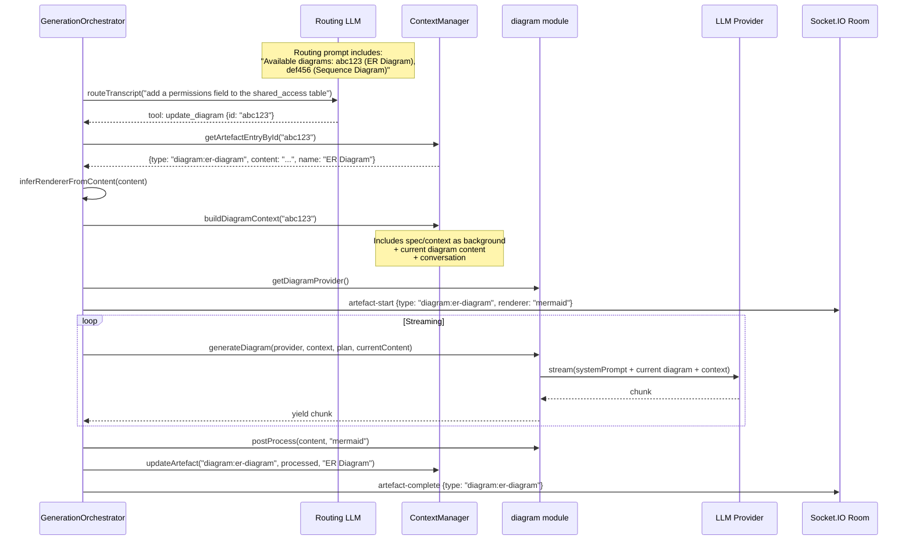
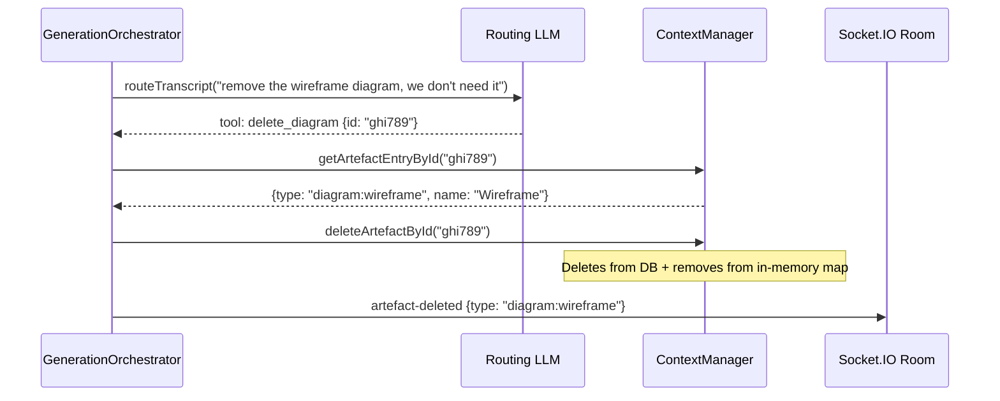
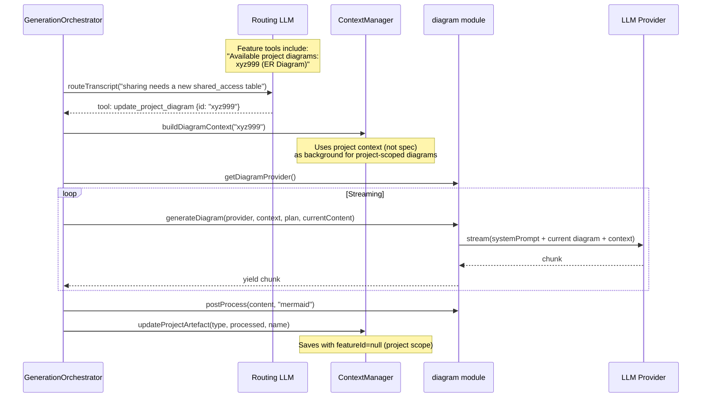
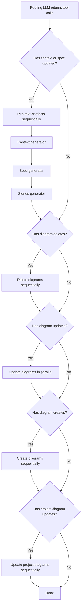

# Feature Meeting: Speech Processing Flows

How spoken input is processed in a feature meeting, from audio to artefact updates.

## Common Entry Path

All speech follows the same path until routing diverges:

---

## Scenario 1: Irrelevant Speech (no_action)

Small talk, filler words, greetings, off-topic conversation.

The transcript is still stored in the database and added to the context window, but no artefact generation is triggered.

---

## Scenario 2: Feature Specification Update (update_spec)

User describes what the system should do, features, capabilities, requirements.

Spec and stories run sequentially (stories depend on the spec output). The spec prompt receives uploaded documents as labelled "Reference Documents" and spoken words as "Conversation", so the LLM focuses on what was discussed rather than reproducing background material.

---

## Scenario 3: Project Context Update (update_context)

User discusses project vision, goals, scope, constraints, domain.

Even in a feature meeting, the context artefact is always project-scoped.

---

## Scenario 4: New Diagram (create_diagram)

User describes entities, flows, or components that warrant a new visualisation.

The routing LLM chooses the renderer: `mermaid` for technical diagrams (ER, sequence, flowchart) or `html` for wireframes/mockups.

---

## Scenario 5: Update Existing Diagram (update_diagram)

User mentions something that affects an existing diagram.

Multiple diagram updates run in parallel via `Promise.allSettled`.

---

## Scenario 6: Delete Diagram (delete_diagram)

User explicitly asks to remove a diagram.

Deletes are processed before creates/updates in the same routing cycle.

---

## Scenario 7: Update Project Diagram from Feature (update_project_diagram)

Feature discussion affects a project-level diagram (e.g. the sharing feature adds a new entity to the project ER diagram).

This is unique to feature meetings. The project diagram is updated in-place at project scope, so other features and the project view see the change immediately.

---

## Execution Order Within a Single Routing Cycle

When routing returns multiple tool calls (e.g. `update_spec` + `update_diagram` + `create_diagram`):

The entire cycle is guarded by `generating = false`. If new speech arrives during generation, it queues as `pendingTranscript` and triggers a new cycle when the current one finishes.
